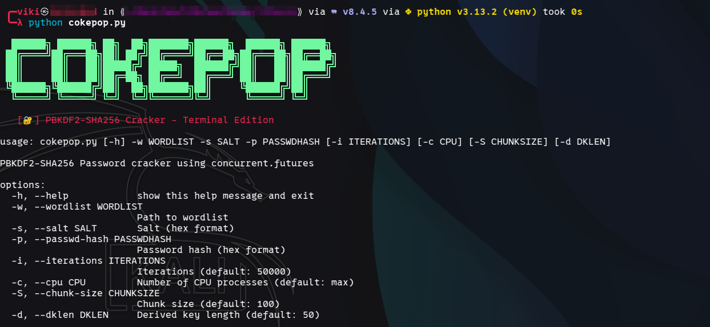
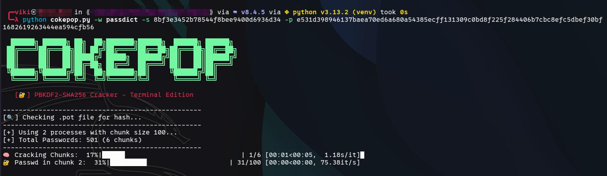
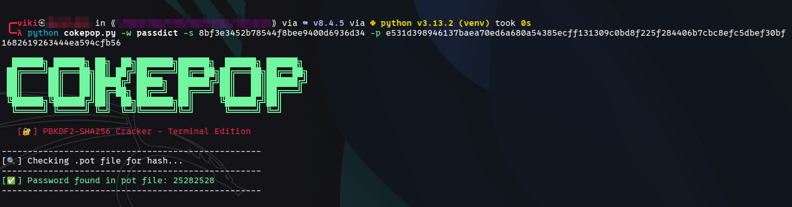

# CokePop - PBKDF2-SHA256 Password Cracker

<div align="center">
  
  
  
  [](https://www.python.org/)
  [](LICENSE)
  
  ```
  ██████╗ ██████╗ ██╗  ██╗███████╗██████╗  ██████╗ ██████╗
 ██╔════╝██╔═══██╗██║ ██╔╝██╔════╝██╔══██╗██╔═══██╗██╔══██╗
 ██║     ██║   ██║█████╔╝ █████╗  ██████╔╝██║   ██║██████╔╝
 ██║     ██║   ██║██╔═██╗ ██╔══╝  ██╔═══╝ ██║   ██║██╔═══╝
 ╚██████╗╚██████╔╝██║  ██╗███████╗██║     ╚██████╔╝██║
  ╚═════╝ ╚═════╝ ╚═╝  ╚═╝╚══════╝╚═╝      ╚═════╝ ╚═╝
  ```

</div>

## 🔑 Overview

CokePop is a high-performance, terminal-based PBKDF2-SHA256 password cracker designed to efficiently test wordlists against password hashes. It leverages Python's `concurrent.futures` module to distribute the workload across multiple CPU cores, dramatically speeding up the cracking process.

## ✨ Features

- **Multi-processing support** - Utilizes all available CPU cores for maximum performance
- **Progress tracking** - Real-time visual progress indicators using tqdm
- **Password caching** - Saves cracked passwords in a pot file for future reference
- **Chunk-based processing** - Intelligently divides workloads for optimal resource utilization
- **Colorized output** - User-friendly terminal interface with visual cues
- **Configurable parameters** - Customize iterations, key length, and more

## 🚀 Installation

```bash
# Clone the repository
git clone https://github.com/yourname/cokepop.git
cd cokepop

# Install dependencies
pip install tqdm
```

## 📖 Usage

```bash
python cokepop.py -w /path/to/wordlist.txt -s <salt-in-hex> -p <hash-in-hex> [options]
```

### Required Arguments

- `-w, --wordlist`: Path to the wordlist file
- `-s, --salt`: Salt in hexadecimal format
- `-p, --passwd-hash`: Password hash in hexadecimal format

### Optional Arguments

- `-i, --iterations`: Number of PBKDF2 iterations (default: 50000)
- `-c, --cpu`: Number of CPU processes to use (default: all available)
- `-S, --chunk-size`: Number of passwords to process in each chunk (default: 100)
- `-d, --dklen`: Derived key length for PBKDF2 (default: 50)

## 🔍 Example

```bash
python cokepop.py -w rockyou.txt -s 5341c7952ca5bbcc -p a3f2d909b51a1f2f5d5cecc9b54ed6e24e4d29a1 -i 10000
```

## ❓ Demo






## 💡 How It Works

1. CokePop first checks its pot file (`.cokepop.pot`) to see if the hash has already been cracked
2. If not found in the pot file, it reads the wordlist and divides it into manageable chunks
3. Each chunk is distributed across multiple CPU cores for parallel processing
4. Progress is displayed in real-time using dual progress bars (chunks and passwords)
5. When a match is found, the password is displayed and saved to the pot file

## 📊 Performance Tips

- **Chunk Size**: Adjust the chunk size based on your system's memory. Smaller chunks require less memory but may have more overhead
- **CPU Count**: For maximum performance, use all available CPU cores, but reduce if you need to use your computer for other tasks
- **Wordlist Selection**: Start with the most probable passwords to increase chances of early success

## 🤝 Contributing

Contributions are welcome! Feel free to submit pull requests or open issues.

1. Fork the repository
2. Create your feature branch (`git checkout -b feature/amazing-feature`)
3. Commit your changes (`git commit -m 'Add some amazing feature'`)
4. Push to the branch (`git push origin feature/amazing-feature`)
5. Open a Pull Request

## 📜 License

Distributed under the MIT License. See `LICENSE` for more information.

## 🙏 Acknowledgments

- The [tqdm](https://github.com/tqdm/tqdm) library for the excellent progress bars
- The Python `concurrent.futures` module for parallel processing capabilities
- All contributors and testers who have helped improve this tool
